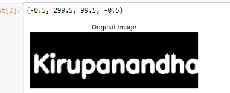
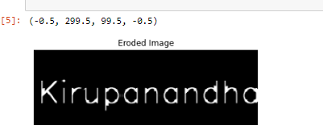
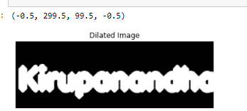

# Implementation-of-Erosion-and-Dilation
## Aim
To implement Erosion and Dilation using Python and OpenCV.
## Software Required
1. Anaconda - Python 3.7
2. OpenCV
## Algorithm:
### Step1:
<br>Import the necessary packages.


### Step2:
<br>Create the Text using cv2.putText.

### Step3:
<br>Create the structuring element.

### Step4:
<br>Erode the image

### Step5:
<br>Dilate the image.

 
## Program:

``` Python
# Import the necessary packages
import cv2
import numpy as np
from matplotlib import pyplot as plt


# Create the Text using cv2.putText
img1=np.zeros((100,300),dtype= 'uint8') 
font=cv2.FONT_HERSHEY_SIMPLEX
cv2.putText(img1,'BHARATH',(5,70),font,1.4,(355),5,cv2.LINE_AA)
plt.imshow(img1,cmap='gray')
plt.title("Original Image")
plt.axis('off')


# Create the structuring element
kernel = cv2.getStructuringElement(cv2.MORPH_CROSS,(7,7))


# Erode the image
image_erode = cv2.erode(img1,kernel)
plt.title("Eroded Image")
plt.imshow(image_erode,cmap='gray')
plt.axis('off')


# Dilate the image
image_dilate = cv2.dilate(img1,kernel)
plt.title("Dilated Image")
plt.imshow(image_dilate,cmap='gray')
plt.axis('off')


```
## Output:

### Display the input Image

<br>
<br>
<br>
<br>
<br>

### Display the Eroded Image

<br>
<br>
<br>
<br>
<br>

### Display the Dilated Image

<br>
<br>
<br>
<br>
<br>

## Result
Thus the generated text image is eroded and dilated using python and OpenCV.